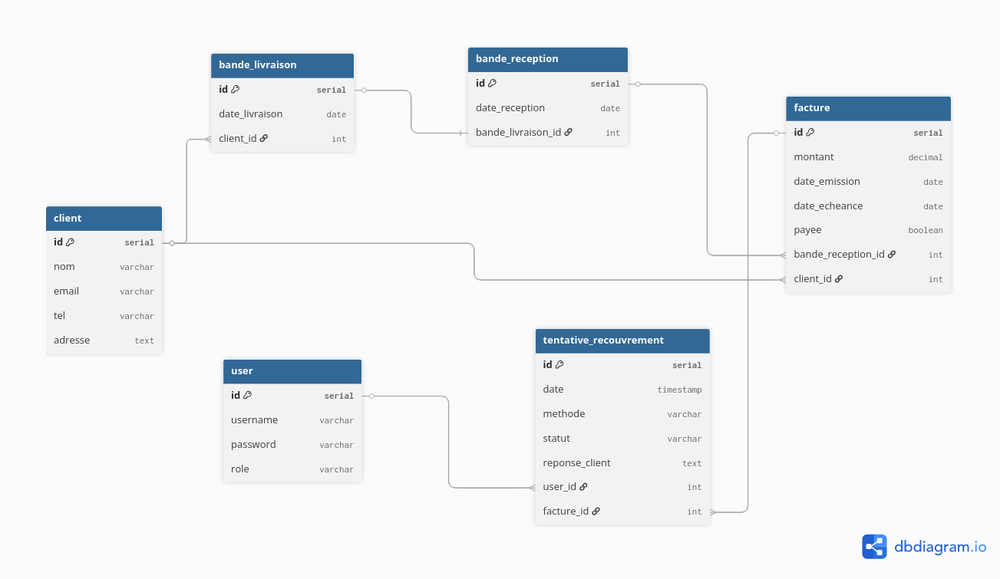

# 📦 Recouvra – Application de gestion du recouvrement
Application web développée avec Spring Boot, Spring Security et PostgreSQL pour automatiser le processus de **recouvrement des paiements** à l’Institut Pasteur de Casablanca.

---

## 🧠 Contexte
L’Institut Pasteur de Casablanca commercialise des produits (ex. : vaccins) à des clients variés. Après livraison, le processus de recouvrement des paiements est manuel et non centralisé (emails, appels, visites, etc.). Le projet consiste vise à digitaliser le suivi des factures impayées et à faciliter le travail des agents de recouvrement à travers une application web interne.

---

## 🎯 Objectifs
- Automatiser l’identification des factures impayées
- Faciliter la relance client via email, téléphone ou visite
- Suivre l’historique des tentatives de recouvrement
- Offrir un tableau de bord clair aux agents

---

## 👥 Utilisateurs

| Rôle           | Description                                      |
|----------------|--------------------------------------------------|
| **Agent**      | Suit les paiements, effectue les relances        |
| **Administrateur** | Gère les comptes utilisateurs et les accès     |

---

## ⚙️ Fonctionnalités principales

### Clients
- CRUD client (nom, email, téléphone, adresse)

### Bandes
- **Bande de livraison** créée par le commercial
- **Bande de réception** reçue du client après livraison

### Factures
- Créées après réception
- Statut : payée ou non
- Suivi automatique des échéances

### Recouvrement
- Affiche les factures échues non payées
- Ajout de tentatives (email, appel, visite)
- Historique avec date, agent, statut, réponse client

### Sécurité
- Login protégé (Spring Security)
- Rôles : ADMIN / AGENT

---

## 🧱 Modèle de données (entités)

- **Client** : nom, email, téléphone, adresse
- **User (agent)** : username, mot de passe, rôle
- **BandeLivraison** : date, client
- **BandeReception** : date, bandeLivraison
- **Facture** : montant, date émission, échéance, payée, client, bandeReception
- **TentativeRecouvrement** : date, méthode, statut, réponse client, user, facture

---

## 💡 Technologies utilisées

| Composant       | Technologie |
|-----------------|------------|
| Backend         | Spring Boot |
| Sécurité        | Spring Security |
| ORM             | Spring Data JPA |
| Base de données | PostgreSQL |
| Authentification | Basic Auth |
| Tests           | Postman    |

---

## 📊 Tableau de bord

- Liste des factures impayées
- Statistiques de relance
- Filtres par client, date, agent

---

## 📌 Roadmap

| Étape        | Description                          |
|--------------|--------------------------------------|
| ✅ Étape 1   | Analyse + Diagrammes UML              |
| ✅ Étape 2   | Création des entités + BDD PostgreSQL |
| ⏳ Étape 3   | Services, Repositories, Controllers   |
| ⏳ Étape 4   | Authentification + Dashboard          |
| ⏳ Étape 5   | Gestion du recouvrement               |
| ⏳ Étape 6   | Tests, UX, documentation finale       |

---

## ✅ Objectifs finaux

- Interface claire et simple
- Gestion fiable du suivi des paiements
- Amélioration de la communication client
- Centralisation de l'historique de relance

---

**Projet personnel réalisé par Yasmine koulam 👩‍💻 – Étudiante en génie informatique**  
**Stage à l’Institut Pasteur de Casablanca**
